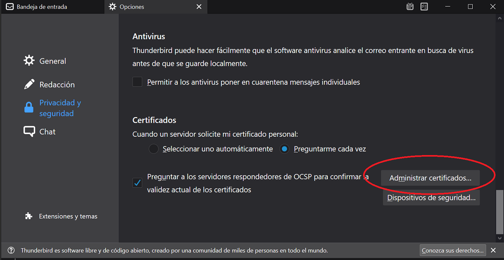
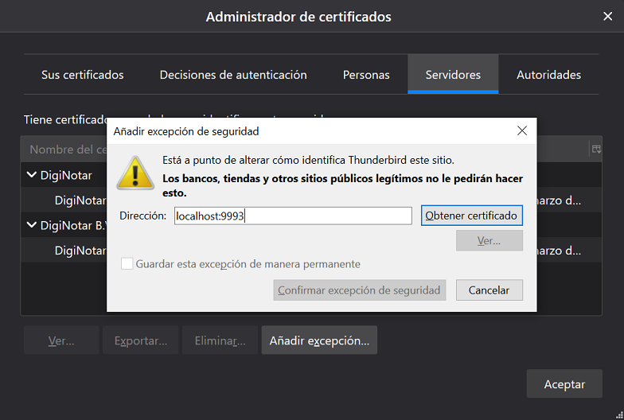
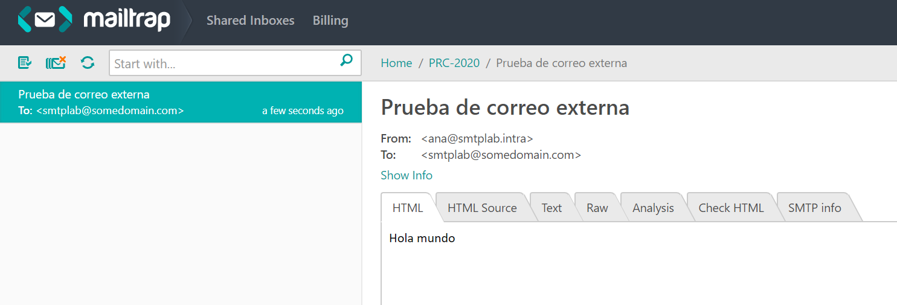

# Laboratorio 2 - SMTP

El laboratorio consiste en realizar una configuración rápida de correo
utilizando un servidor dentro de un contenedor de docker.

## Prerequisitos

* docker 19 o superior
* docker-compose 1.3 o superior
* Mac OS/Linux/Windows con WSL2
* curl para descarga opcional de archivos
* Terminal bash o zsh

## Práctica

**Descarga** el contenido de este [repositorio](https://github.com/javiertoledos/lab2-smtp-imap/archive/master.zip)
para utilizarlo en los siguientes pasos.

### Instalando un cliente de correos: 

Ve al sitio de [Thunderbird](https://www.thunderbird.net/es-ES/) y descarga el 
cliente.

Thunderbird es un cliente de correos que soporta el envío y recepción de 
mensajes utilizando IMAP y SMTP respectivamente. También soporta POP3 que es un
protocolo de recepción de correos de menores prestaciones que IMAP.

Se ejemplificará como conectarse al servidor de pruebas utilizando conexión
segura. Para que el laboratorio funcione, deberá agregarse una excepción a los
certificados ya que estamos utilizando certificados autofirmados los cuales no
son válidos para entornos de producción. Se detallarán los pasos más adelante.

### Levantando un servidor de correos

El [contenido del laboratorio](https://github.com/javiertoledos/lab2-smtp-imap/archive/master.zip)
utiliza una imagen de docker hecha por Thomas Vial. Detalles adicionales de la 
configuración de dicha imagen se pueden encontrar en su
[repositorio](https://github.com/tomav/docker-mailserver).

Describiendo brevemente las características que usaremos de dicha imagen
destacan:
* [postfix](http://www.postfix.org/) 

  Es uno de los servidores SMTP más utilizados en sistemas tipo UNIX. Permite 
  a los usuarios enviar correos y también permite recibir de otros destinos
  guardando en buzones los correos de los usuarios que se reciban de otros 
  dominios

* [dovecot](https://www.dovecot.org/)

  Es un servidor de IMAP y POP3 enfocado a seguridad que al unirlo con postfix
  provee un servicio completo de envío y recepción de correos por parte de los
  usuarios.

* [spamasassin](https://spamassassin.apache.org/)

  Es un proyecto de la fundación de Apache que provee un sistema de código 
  abierto para bloquear spam. La inspección de contenido se conecta a postfix
  gracias a [amavis](https://www.amavis.org/) el cual permite la integración
  entre MTA (postfix) y revisores de contenido como Spamassin o servicios de
  antivirus como [ClamAV](https://www.clamav.net/)

Estos servicios se encuentran normalmente instalados y configurados en servicios
de reselling de hosting (ej. WHM/CPanel) como un mecanismo para proveer correos.
Sin embargo, pueden ser utilizados de forma independiente en infraestructura
local instalandolos en un servidor tipo unix, o en este caso específico: docker.

Este repositorio cuenta con la siguiente estructura:
```
.
├── README.md
├── config
│   ├── dovecot-quotas.cf           # Permite cuotas de almacenamiento
│   ├── postfix-accounts.cf         # Define las cuentas y credenciales
│   ├── postfix-aliases.cf          # Define aliases limitado a cuentas locales
│   ├── postfix-virtual.cf          # Define aliases para cuentas en general
│   ├── postfix-main.cf             # Configuración principal de postfix
│   ├── postfix-sasl-password.cf    # Autenticación por sasl (para mailtrap.io)
│   └── ssl                         # Certificados autofirmados para SSL/TLS
│       ├── demoCA
│       │   └── cacert.pem
│       ├── smtplab.intra-cert.pem
│       ├── smtplab.intra-combined.pem
│       └── smtplab.intra-key.pem
└── docker-compose.yml              
```

Los archivos que estarás modificando serán los de extensión .cf dentro de la 
carpeta config.

Los certificados autofirmados deben manejarse con cuidado y la excepción para su
uso debe ser removida al finalizar el laboratorio. Nunca se debe utilizar 
certificados autofirmados en entornos de producción. 

Levanta el servicio de mail con docker compose:

```bash
docker-compose up
```

### Añadiendo la excepción en el cliente de correo

1. Primero se debe agregar una excepción de los certificados al cliente de 
  Thunderbird. Con el servicio de correos levantado. Se debe ir a 
  `Herramientas > Opciones > Administrar certificados...`

    

2. Luego en `Servidores > Añadir excepción...` Se mostrará un dialogo que permite
  crear una excepción conectandose al servidor. Crearemos dos excepciones, una
  para el puerto de envío **4465** y otra para la recepción **9993**.

    

## Ejercicios

1. El laboratorio se encuentra preconfigurado con dos usuarios para envío y 
  descarga de correos por SMTP e IMAP:
    - User: `ana@smtplab.intra` Password: `testing`
    - User: `pablo@smtplab.intra` Password: `testing`
  
    Configura el cliente de correos (Thunderbird) para que pueda conectarse con
  cualquiera de estos dos usuarios y envía un correo de prueba al otro usuario
  configurado. Recuerda que el host es tu propio equipo `localhost` con los 
  puertos `4465` y `9993` expuestos para SMTP e IMAP respectivamente.

2. Una vez que se probó que el envío local es exitoso, se puede configurar el 
  envío de correos a otros servidores. Debido a la configuración de prueba 
  utilizada, el envío o recepción de correos con otros servicios puede fallar ya
  que no cuenta con la configuración DNS y de seguridad necesarias. Una forma de
  probar clientes o servicios SMTP antes de colocarlos en un entorno de 
  producción es utilizando [mailtrap.io](https://mailtrap.io/).
    - Crea una cuenta y crea un buzón, luego finaliza la configuración de relay
    agregando la autenticación SASL (para smtp.mailtrap.io) para que los correos
    externos sean enviados a dicho servicio. En una configuración de producción,
    esto podría hacerse a un servidor de RELAY de G-Suite para analisis de 
    SPAM y antivirus.
    - Recuerda reiniciar el contenedor de docker para que tome la nueva 
    configuración. Envía un correo de prueba a `smtplab@somedomain.com`.  Si la 
    configuración es correcta, en el sitio de mailtrap.io debería aparecer de 
    esta manera:
    
    

3. Crea una nueva cuenta con tu nombre y apellido y añadele un alias de 
  it@smtplab.intra en el servidor de prueba. Lo puedes realizar editando 
  los archivos de configuración de Postfix `config/postfix-accounts.cf` y
  `config/postfix-virtual.cf` o utilizando la herramienta de configuración de
  Thomas Vial que provee helpers para configurarlo por uno. Para esta segunda
  opción descarga el archivo de setup como indica su repositorio:
    ```
    curl -o setup.sh https://raw.githubusercontent.com/tomav/docker-mailserver/master/setup.sh; chmod a+x ./setup.sh
    ``` 
    y luego ejecútalo para ver las opciones disponibles.

  Utiliza el usuario de Ana o Pablo para verificar que el correo que recién 
  creaste funciona junto con su respectivo alias. Notarás que esta prueba no
  llegó al servicio de mailtrap previamente configurado ya que al tratarse de
  cuentas locales, no se utiliza el servicio de relay para reenviar el correo.
  
  Servicios como Zoho mail o G-Suite permiten la asignación de aliases a cuentas
  para tener un solo buzón que reciba correos de multiples direcciones. Una 
  configuración de producción de Postfix probablemente esté en conjunto de 
  software que cree las cuentas como WHM/CPANEL o utilice una conexión de LDAP
  para

## Entrega
1. Configura el servidor de relay para usar las credenciales de mailtrap.io para
  evaluación en vez de tu cuenta personal. Estas estarán disponibles en la
  plataforma GES en la sección de apuntes de clase.
2. Con el relay configurado utilizando las credenciales de evaluación, envía un 
   correo electrónico desde la cuenta que creaste con tu nombre a la dirección 
   `evaluacion@ejemplo.com` con asunto `[PRC] Lab2 <numero de carné>` y como 
   cuerpo de mensaje contesta lo siguiente:
    - las ventajas y desventajas entre utilizar POP3 e IMAP como protocolos para
    obtener correos de un buzón de mensajería.
    - Explica brevemente que es y como funciona SASL.
    - La diferencia entre los términos MUA, MTA y MDA.
  
    **IMPORTANTE**: Asegurate de mandar únicamente 1 correo.

3. Crea un archivo zip con el nombre `lab2-<numero de carne>.zip`. Es requerido
  respetar este nombre ya que se evaluará con una herramienta automática el
  laboratorio y en caso de no seguir instrucciones, no se evaluará la respuesta.
4. En el archivo zip se debe colocar el contenido modificado que se descargó al
  inicio de la práctica. Nuevamente, es importante que el archivo .zip tenga la
  misma estructura de directorios:
    **Correcto:**
    ```
    lab2-20072089.zip
    ├── README.md
    ├── config
    │   ├── ... archivos de configuracion
    │   └── ssl  
    │       ├── demoCA
    │       │   └── ... archivos de certificados
    │       └── ... archivos de certificados
    └── docker-compose.yml 
    ```
    **Incorrecto:**
    ```
    laboratorio.zip
    └──lab2-smtp-imap
        ├── README.md
        ├── config
        │   └── ssl  
        └── docker-compose.yml 
    ```

